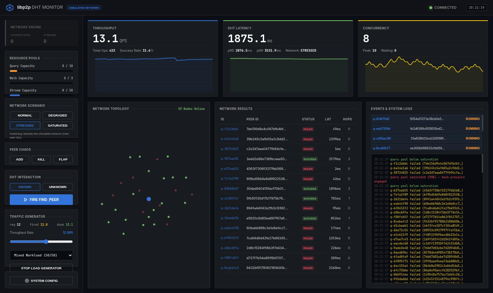

# libp2p DHT Monitor

[](https://github.com/yashksaini-coder/kad-monitor/actions/workflows/ci.yml)

**Production-grade test harness and real-time dashboard for validating the
`DHTQueryCoordinator` fix described in the Technical Design Doc:
"Resolving DHT Resource Exhaustion".**



*Live dashboard under a STRESSED scenario at 12 QPS: the query pool is
saturated (Layer A gauge red at 10/10), excess queries queue instead of
exhausting streams, and the event log narrates each back-pressure engagement.*

---

## Documentation

| Doc | What's in it |
|---|---|
| [docs/SETUP.md](docs/SETUP.md) | Dev environment, running, testing, optional real-libp2p mode |
| [docs/CLI.md](docs/CLI.md) | Every flag with defaults, plus recipes |
| [docs/DEPLOYMENT.md](docs/DEPLOYMENT.md) | Docker Compose deployment, exposure/safety, observability, upgrades |
| [CONTRIBUTING.md](CONTRIBUTING.md) | Ground rules, test expectations, commit/PR conventions |

---

## Architecture Overview

```
┌──────────────────────────────────────────────────────────┐
│                  Single Trio Event Loop                   │
│                                                          │
│  ┌──────────────────┐    ┌───────────────────────────┐  │
│  │ DHTQueryCoordinator│   │      SimulatedDHTNetwork  │  │
│  │                  │    │   (Kademlia-style DHT)    │  │
│  │  Layer A:        │    │                           │  │
│  │  trio.CapacityLimiter│ │  50-100 virtual nodes     │  │
│  │  (max_queries)   │    │  XOR-distance routing     │  │
│  │                  │    │  Configurable scenarios   │  │
│  │  Layer B:        │    └───────────┬───────────────┘  │
│  │  trio.CapacityLimiter│            │ query_fn           │
│  │  (max_walks)     │◄───────────────┘                  │
│  └────────┬─────────┘                                    │
│           │ on_snapshot                                  │
│           ▼                                              │
│  ┌──────────────────┐    ┌───────────────────────────┐  │
│  │  StreamManager   │    │    Background Workers     │  │
│  │                  │    │                           │  │
│  │  trio.CapacityLimiter│ │  random_walk_worker       │  │
│  │  (max_streams)   │    │  load_generator           │  │
│  │  try…finally     │    │  metrics_broadcaster      │  │
│  │  stream lifecycle│    └───────────────────────────┘  │
│  └──────────────────┘                                    │
│                                                          │
│  ┌──────────────────────────────────────────────────┐   │
│  │       FastAPI (Hypercorn / Trio ASGI backend)    │   │
│  │                                                  │   │
│  │  REST: /api/query  /api/config  /api/loadgen     │   │
│  │        /api/network/scenario   /api/snapshot     │   │
│  │  WS:   /ws  (500ms push of full system snapshot) │   │
│  │  UI:   /    (real-time dashboard)                │   │
│  └──────────────────────────────────────────────────┘   │
└──────────────────────────────────────────────────────────┘
```

---

## The Fix: Dual-Layer `trio.CapacityLimiter`

| Layer | Component | Role |
|-------|-----------|------|
| **A** | `DHTQueryCoordinator._query_limiter` | Hard cap on ALL DHT queries |
| **B** | `DHTQueryCoordinator._rw_limiter` | Sub-cap on background random walks |
| **C** | `StreamManager._limiter` | Hard cap on physical streams |

**Before the fix** (original py-libp2p behaviour):
- Random walks + user queries competed for unlimited streams
- Timed-out queries leaked stream slots → `Stream limit exceeded`
- Subsequent calls hung forever at `nursery.start_soon(...)`

**After the fix** (this implementation):
- All acquisitions go through `async with limiter:` — guaranteed back-pressure
- `try … finally` in `StreamManager.open_stream` ensures slots always return
- `trio.move_on_after` enforces per-query deadlines with clean cancellation

---

## Quick Start

### 1. Install dependencies

```bash
cd kad-monitor
python -m venv .venv && source .venv/bin/activate
pip install -r requirements.txt
```

Simulated mode (the default) needs only `trio`, `fastapi`, `hypercorn[trio]`,
`anyio[trio]`, and `pydantic` — all installed above. Real libp2p is **optional**
and only required for `--mode real`; it's commented out in `requirements.txt`
because `libp2p==0.6.0` doesn't build on Python 3.14 (coincurve build
failure). See [Swapping in Real py-libp2p](#swapping-in-real-py-libp2p).

### 2. Run the monitor

```bash
python main.py
# Dashboard → http://localhost:8000/
# API docs  → http://localhost:8000/docs
```

### 3. CLI options

```
--host           Bind host          (default: 0.0.0.0)
--port           Bind port          (default: 8000)
--mode           simulated | real   (default: simulated)
--nodes          Simulated nodes    (default: 60)
--scenario       Initial scenario   (NORMAL | DEGRADED | STRESSED | SATURATED)
--max-queries    Layer A cap        (default: 10)
--max-walks      Layer B cap        (default: 3)
--max-streams    Stream pool cap    (default: 50)
--query-timeout  Per-query timeout  (default: 20s)
--walk-interval  Random walk period (default: 4s)
--history-db     SQLite snapshot history path ('' disables)  (default: history.db)
--experiment     Run a headless A/B experiment from a JSON config and exit

# Real mode only:
--libp2p-port, --bootstrap, --enable-mdns, --enable-upnp, --enable-quic,
--enable-random-walk / --no-enable-random-walk, --enable-pubsub / --no-enable-pubsub,
--max-connections, --max-libp2p-streams
```

**Reproduce the original bug** (no coordinator, minimal caps):
```bash
python main.py --max-queries 50 --max-walks 49 --nodes 30 --scenario SATURATED
# Then hammer the load generator at 10+ QPS
# Observe streams exhausting and queries hanging
```

**Demonstrate the fix**:
```bash
python main.py --max-queries 10 --max-walks 3 --nodes 60 --scenario STRESSED
# Layer B cap keeps walks at ≤3 concurrent even at 10 QPS
# User queries always have ≥7 slots reserved
```

---

## Running Tests

```bash
# All tests
pytest tests/ -v

# Coordinator unit tests only
pytest tests/test_coordinator.py -v

# Integration tests
pytest tests/test_integration.py -v

# Specific test
pytest tests/test_coordinator.py::test_background_walks_cannot_starve_user_queries -v
```

`tests/test_libp2p_node.py` skips cleanly when `libp2p` isn't installed —
the full suite is green in a bare simulated-mode venv.

### Key test cases

| Test | What it verifies |
|------|-----------------|
| `test_capacity_limiter_blocks_excess_queries` | >max concurrent queries queue, not crash |
| `test_background_walks_cannot_starve_user_queries` | Layer B isolation works |
| `test_random_walk_cap_enforced` | Peak concurrent walks ≤ `max_random_walks` |
| `test_timeout_enforced` | `trio.move_on_after` fires correctly |
| `test_stream_slots_always_released` | `finally` block works on error |
| `test_no_resource_exhaustion_under_load` | 20 concurrent queries with cap=10: no deadlock |

---

## A/B Experiment

```bash
python main.py --experiment experiments/baseline.json
```

Runs the same workload against two headless arms — no HTTP server involved —
and writes both a JSON and an HTML report to `reports/`. `baseline.json` pits
an `unprotected` arm (caps effectively unlimited) against a `protected` arm
(the real Layer A/B/C caps: 10 queries / 3 walks / 50 streams) against a
STRESSED, 60-node network at 30 QPS for 20s each (~45s total run time). The
unprotected arm's concurrency chases the offered load while the protected
arm holds steady at its 10-query ceiling and queues the rest, trading a
longer tail for a coordinator that never falls over.

A representative full run (both arms, identical 30 QPS workload):

| Metric | unprotected | protected |
|---|---|---|
| Peak concurrent queries | **32** | **10** (the cap) |
| Peak queued (waiting) | 1 | 312 |
| Achieved QPS | 29.1 | 29.0 |

Same throughput, bounded concurrency: that's the whole point of the
dual-layer limiter — the excess load waits in line instead of exhausting
streams and wedging the node.

---

## Docker

```bash
docker compose up
# Dashboard → http://localhost:8000/
```

Builds from `Dockerfile` (single-stage — pure-Python wheels, so a build
stage buys nothing) and runs `main.py` with `--history-db /data/history.db`.
Snapshot history persists across restarts in the `kad-data` named volume.
The image ships a `HEALTHCHECK` that polls `/healthz`.

---

## Swapping in Real py-libp2p

The coordinator accepts any `async (peer_id: str) → (found, closest_peers, hops)` callable.
Real mode wires this up automatically — no code changes needed:

```bash
pip install libp2p==0.6.0 multiaddr>=0.0.9 base58>=2.1.1
python main.py --mode real --libp2p-port 4001 --bootstrap /ip4/1.2.3.4/tcp/4001/p2p/PeerID...
```

`main.py --mode real` constructs a `Libp2pNode` (KadDHT + GossipSub +
ResourceManager, `src/libp2p_node.py`) and wraps it in `RealDHTNetwork`, an
adapter that exposes the same `query()` / `snapshot()` / `set_scenario()` /
`peer_ids` surface as `SimulatedDHTNetwork` — so the coordinator, StreamManager,
and workers treat real and simulated backends identically. `libp2p` is only
imported inside this code path; simulated mode (the default) never touches it.

---

## Project Structure

```
kad-monitor/
├── src/
│   ├── coordinator.py      # DHTQueryCoordinator (trio.CapacityLimiter dual-layer)
│   ├── stream_manager.py   # StreamManager (physical stream lifecycle)
│   ├── dht_simulation.py   # Kademlia-style DHT simulation
│   ├── libp2p_node.py      # Libp2pNode + RealDHTNetwork (real libp2p, --mode real only)
│   ├── experiment.py       # Headless A/B experiment runner
│   ├── history.py          # SQLite-backed snapshot history
│   └── workers.py          # Background trio tasks
├── api/
│   └── app.py              # FastAPI app (REST + WebSocket)
├── static/
│   └── index.html          # Real-time monitoring dashboard
├── experiments/
│   └── baseline.json       # A/B experiment config (see A/B Experiment)
├── tests/
│   ├── test_coordinator.py # Unit tests (pytest-trio)
│   └── test_integration.py # Integration tests
├── main.py                 # Entry point (Hypercorn + Trio)
├── pyproject.toml          # pytest config (trio_mode), project metadata
├── Dockerfile
├── docker-compose.yml
├── .github/workflows/ci.yml
├── requirements.txt
└── README.md
```

---

## Endpoints

| Method | Path | Purpose |
|--------|------|---------|
| GET | `/healthz` | Liveness check (used by Docker `HEALTHCHECK`) |
| GET | `/metrics` | Plaintext metrics snapshot |
| GET | `/api/snapshot` | Full system snapshot (same shape as WS pushes) |
| GET | `/api/history` | Recent snapshot history from SQLite (survives reload) |
| GET | `/api/nodes` | Current simulated/real network node list |
| POST | `/api/query` | Fire a single manual `find_peer` query |
| POST | `/api/config` | Hot-reload `max_queries` / `max_walks` / `query_timeout` / `max_streams` |
| POST | `/api/network/scenario` | Switch NORMAL / DEGRADED / STRESSED / SATURATED |
| GET/POST | `/api/loadgen` | Read / start-stop-configure the load generator |
| POST | `/api/network/peer` | Add a peer (chaos control) |
| DELETE | `/api/network/peer/{id}` | Remove a peer (chaos control) |
| POST | `/api/network/peer/{id}/toggle` | Kill/revive a peer online/offline (chaos control) |
| POST | `/api/dht/put` \| `/api/dht/get` | DHT key-value put/get |
| POST | `/api/dht/provide` \| `/api/dht/providers` | Content routing (provide/find-providers) |
| POST | `/api/pubsub/subscribe` \| `/unsubscribe` \| `/publish` | GossipSub controls |
| GET | `/api/pubsub/topics` | Subscribed topics |
| POST | `/api/peer/connect` | Dial a peer (real mode) |
| GET | `/api/peer/connected` | Connected peers |
| GET | `/api/node/info` | Node identity / listen addresses |
| WS | `/ws` | 500ms push of full system snapshot |
| GET | `/` | Dashboard UI |

---

## Dashboard Features

| Panel | Description |
|-------|-------------|
| **Capacity Limiters** | Live gauge of Layer A / Layer B / Stream pool utilisation |
| **Query Counters** | Total / success / failed / timeout with success % |
| **Throughput chart** | Rolling QPS over last 60 ticks, requested/fired/done load-gen counters |
| **Duration chart** | Rolling avg duration (ms), with p95/p99 latency percentiles |
| **Concurrency chart** | Rolling concurrent query count |
| **Live Queries** | Real-time view of in-flight queries with status |
| **Network Topology** | SVG map of nodes (green=online, red=offline) with live lookup-path rendering as queries hop |
| **Recent Results** | Scrollable result table with full metadata |
| **Event Log** | Real, timestamped stream of scenario changes, chaos events, and query outcomes |

### Interactive Controls

- **Fire Query**: Single manual `find_peer` (known or unknown peer)
- **Load Generator**: Continuous query storm at configurable QPS
- **Scenario Switcher**: Buttons to flip between NORMAL / DEGRADED / STRESSED / SATURATED live
- **Peer Chaos**: Add / kill / revive individual peers to watch the network and topology react
- **System Config**: Modal to hot-reload `max_queries`, `max_walks`, `query_timeout`, `max_streams`, `stream_timeout` (5 fields)
</content>

---

## Project Status & Honest Limitations

**What this is:** a learning project — built to explore py-libp2p and to demonstrate one
specific idea (dual-layer `trio.CapacityLimiter` back-pressure) with measurements rather
than assertions. It is a lab and a piece of evidence, not a product.

**What it is not:** a general-purpose DHT monitor, a load-testing tool for your own
services, or a teaching instrument. Anyone arriving cold should expect a demo aimed at a
specific technical claim, not a tool aimed at their problem.

### Known limitations

- **It starts working before you ask it to.** The random-walk worker fires a background
  DHT lookup every 4s from boot, so the dashboard opens mid-flight rather than idle.
  There is no "press start" state. (`--no-enable-random-walk` disables it.)
- **The dashboard assumes you already know the domain.** Kademlia terms (`FIND_PEER`,
  XOR distance, hops), `trio.CapacityLimiter` semantics, and the Layer A/B/C nesting are
  never explained on screen. There is essentially no in-UI help text.
- **Scenarios are fixed presets.** You can select NORMAL / DEGRADED / STRESSED /
  SATURATED, but the parameters behind them (latency, jitter, offline ratio, stream-error
  rate, unknown-peer rate) are hardcoded in `ScenarioConfig` and cannot be tuned without
  editing `src/dht_simulation.py`. Same for k-bucket size, max hops, and lookup fan-out.
- **The core is more general than the framing.** `DHTQueryCoordinator.find_peer` accepts
  any `async (id) -> (found, list, hops[, path])` callable and never inspects the result —
  the DHT specificity lives in four nearly identical three-line closures. The limiter
  engine would gate any async workload; only the topology view and results table are
  genuinely DHT-shaped.
- **Real py-libp2p mode is under-verified.** Hop counts are approximated, the pubsub
  receive path is not surfaced, `StreamManager` counts synthetic slots rather than real
  libp2p streams, and `libp2p==0.6.0` will not install on Python 3.14.

### Parked roadmap (non-essential)

Recorded for completeness; none of it is planned work.

1. **Cold open** — idle first paint, opt-in traffic, and a guided
   "run without limits → run with limits → compare" narrative driven by the existing
   `/api/config` and `/api/loadgen` endpoints.
2. **Self-explaining UI** — in-panel explanations of the limiter layers and metrics.
3. **Editable scenarios** — expose the `ScenarioConfig` parameters through the API and
   dashboard so network conditions become tunable instead of a fixed menu.
4. **Concurrency sweep** — `run_experiment` already accepts arbitrary named arms, so a
   sweep across `max_queries` is a config file plus a chart; it would show throughput
   flat while p95 and queue depth climb, which is Little's Law in one picture.
5. **Generic harness** — decouple from the DHT so the limiter engine and experiment
   runner can be pointed at any async workload.
